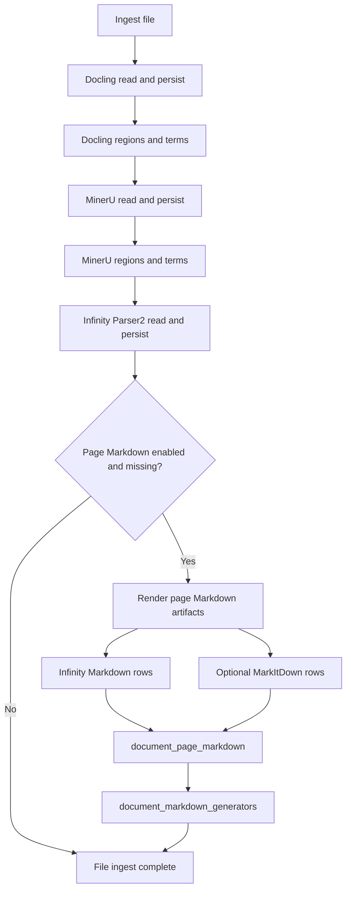

# Page Markdown Pipeline

This document describes the current per-page Markdown pipeline: where it runs
inside ingest, how source pages are converted to lightweight JPEG artifacts, and
which engines can write `document_page_markdown` rows.

The short version is:

- Page Markdown runs after annotation-region persistence for the active engines:
  Docling, MinerU, and Infinity Parser2.
- The default Markdown generator is `infinity_markdown`.
- `markitdown` and `markitdown_cu` can also be requested explicitly or through
  `--page-markdown-engines all`.
- Direct LM Studio Markdown generation has been removed. LM Studio is now only a
  backend transport for Infinity Parser2 when `--infinity-backend lmstudio` is
  selected.
- Region-to-Markdown mapping and cross-engine evidence prompts remain removed.
  Markdown generation reads the visible page artifact directly.

See also:

- [Infinity Parser2 engine](infinity-parser2-engine.md)
- [LM Studio backend](lmstudio-engine.md)
- [Schema reference](schema.md)

## Pipeline Placement

The page Markdown pass sits after annotation-region persistence, so generated
Markdown is tied to the same document state the viewer uses. It does not include
region evidence in the prompt.



## Markdown Generators

Trapo stores each generator under a distinct `markdown_engine`, so the preview
can compare outputs without overwriting rows:

- `infinity_markdown` - Infinity Parser2 `doc2md` per page. This is the default
  generator and uses `infly/Infinity-Parser2-Flash` for local package backends
  or `infinity-parser2-flash` for LM Studio-backed runs.
- `markitdown` - MarkItDown local conversion. For PDFs, Trapo splits emitted
  page sections into per-page rows when possible. For raster image inputs, Trapo
  renders every image frame to cached JPEG page artifacts and passes those
  `.jpg` files to MarkItDown.
- `markitdown_cu` - MarkItDown Azure Content Understanding conversion. This is
  opt-in because it requires an Azure endpoint and credentials.
- `best_available_markdown` - virtual API/viewer engine. It selects the best
  persisted provider row per page using the priority order
  `infinity_markdown`, `markitdown`, then `markitdown_cu`, and falls back to OCR
  text only when no provider row exists for the active page.

Provider-specific selections do not use the OCR fallback. This keeps debugging
clear: choosing `infinity_markdown` shows only Infinity rows, while choosing
`markitdown` shows only MarkItDown rows.

## LM Studio Context Preflight

When Infinity Parser2 is hosted by LM Studio, Trapo uses the LM Studio native
REST API before the OpenAI-compatible chat calls:

1. Strip `/v1`, `/api/v1`, or `/api/v0` from `--lmstudio-base-url` to find the
   native LM Studio base URL.
2. Read model metadata from `/api/v1/models`.
3. Best-effort unload other active models.
4. Find the configured Infinity model and read its `max_context_length`.
5. If the model is already loaded below the known maximum context, unload that
   target instance so LM Studio cannot reuse a low-context load.
6. If needed, call `/api/v1/models/load` with the allowlisted maximum context
   and `echo_load_config = true`.
7. Use the detected/applied context for subsequent Infinity Parser2 chat calls.

The local `infinity-parser2-flash` LM Studio model is allowlisted at `262144`
context tokens in `trapo/ingest/lmstudio_supported_models.py`. Use
`--lmstudio-no-max-context` only when you intentionally want to skip this
preflight.

## Page Artifacts

Each page is handled independently. That keeps failure scope local and makes the
persisted artifacts easy to reason about.


Default lightweight render settings:

- `page_markdown_render_dpi = 120`
- `page_markdown_image_max_side = 1280`
- `page_markdown_image_format = JPEG`
- `page_markdown_jpeg_quality = 82`
- cache enabled by default

Cache layout:

```text
.cache/
    trapo/
        page-markdown/
            {file_hash}/
                dpi120-side1280-jpeg-q82/
                    manifest.json
                    page-0001.jpg
                    page-0001.json
                    page-0002.jpg
                    page-0002.json
```

The page metadata sidecar records source file hash, page number, display page
dimensions, rendered dimensions, render settings, byte size, image SHA-256,
rotation degrees, cache hit state, and artifact paths. LLM diagnostics link a
filesystem prompt-image path from `llm.request` events. When a caller does not
provide an existing artifact path, diagnostics writes a content-addressed copy
under `.cache/trapo/llm-diagnostics/`.

CLI controls:

```text
--page-markdown-render-dpi
--page-markdown-image-max-side
--page-markdown-image-format
--page-markdown-jpeg-quality
--page-markdown-cache / --no-page-markdown-cache
--page-markdown-cache-root
```

## Failure Handling

Successful pages are persisted immediately. If one page fails, Trapo records
that page error in the generator metadata and continues with later pages. A
generator with mixed successful and failed pages is recorded with `status =
'partial'`, so reruns can detect missing pages without discarding successful
rows from the same document.

## Storage Contract

The page Markdown flow persists provider-specific page rows and generator
status.


`document_markdown_generators` stores one row per file and generator with
`status`, `error`, `page_count`, provider/model identity, and metadata such as
the expected page list. This is the fastest way to diagnose a partial run such
as "Infinity produced pages 1-2 but failed before page 61."

## UI Consumption

The web UI does not regenerate Markdown. It only reads the persisted tables.
Split preview keeps one active page and one active Markdown engine in route
state. The image pane is virtualized for long documents, while the Markdown pane
requests only the active page with
`GET /api/documents/{file_hash}/markdown?markdown_engine=best_available_markdown&page_no=N`
and prefetches nearby pages.

The View menu has a Markdown selector. The default is
`best_available_markdown`, so a page can show MarkItDown text when Infinity has
not produced a row for that page.

Global search includes persisted `document_page_markdown.markdown_text`.
Markdown matches route to the document page with `file`, `page`, `view=split`,
and `highlight=<query>` search params. The preview renders the Markdown normally
and highlights matching rendered text nodes from that route state, without
injecting raw HTML into the stored Markdown.

If split view shows the page preview but no Markdown, the usual causes are:

1. the selected provider has no row for the active page
2. the selected provider row exists but contains empty Markdown
3. page Markdown generation failed during ingest
4. the running server has not been restarted after a code change
