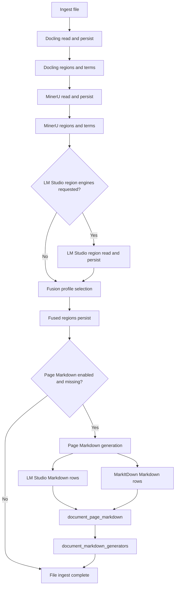
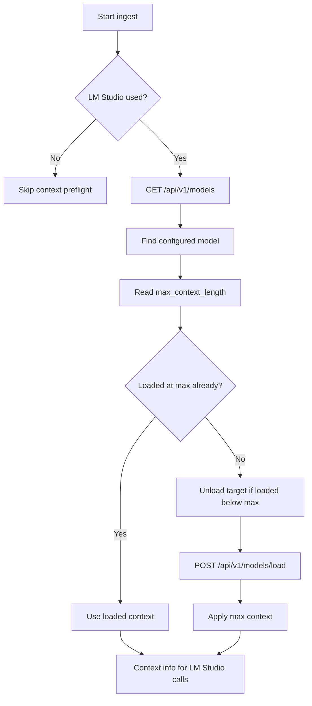
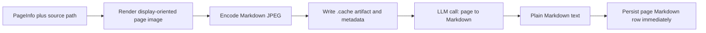
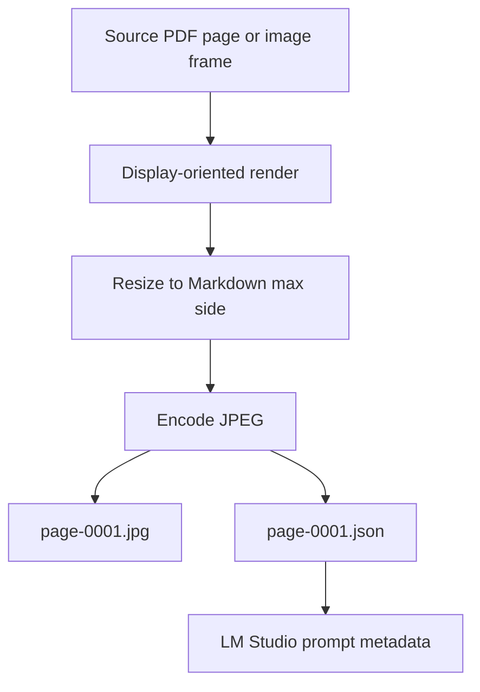
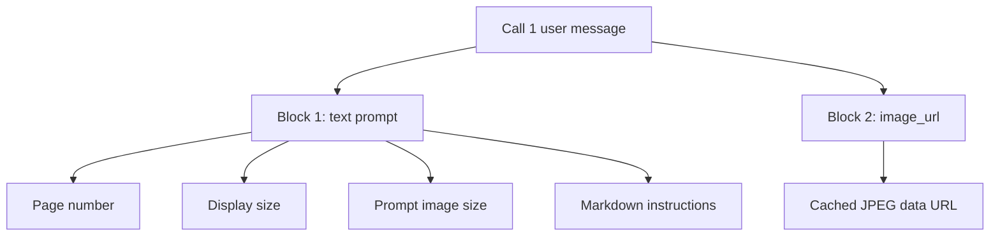
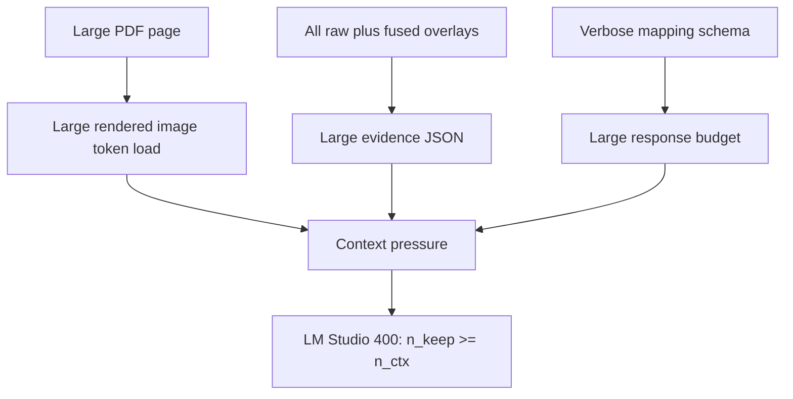
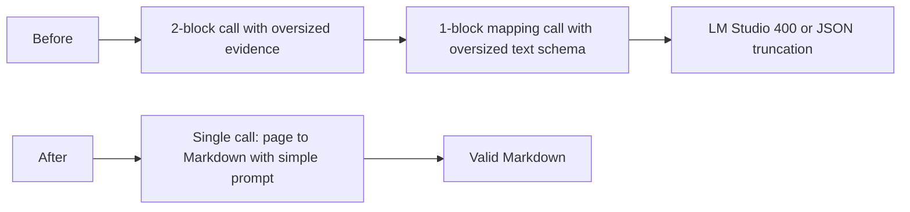
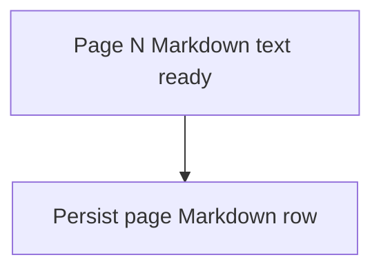
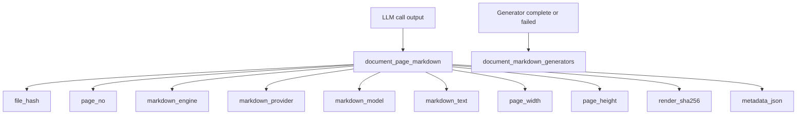
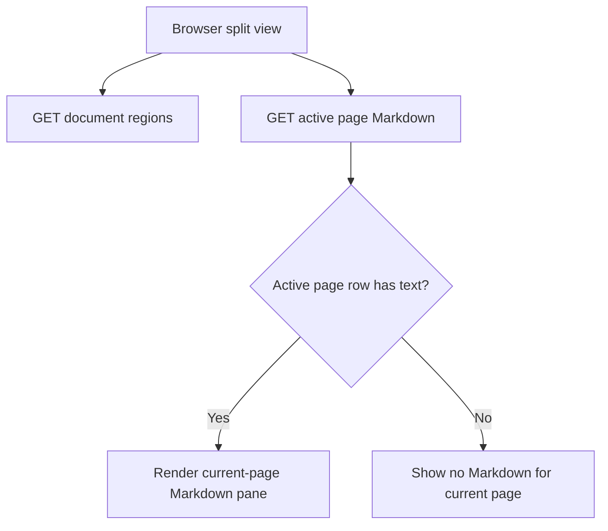

# Page Markdown Pipeline

This document describes the per-page Markdown pipeline in detail: where it runs
inside ingest, how source pages are converted to lightweight JPEG prompt images,
what data is passed to LM Studio on each call, and why PDFs needed a smaller
prompt shape while raster images usually did not.

The short version is:

- The page Markdown pass runs after raw annotation engines and fusion.
- Multiple plain-Markdown generators can run for the same page. The default
    generator set is `markitdown`; `lmstudio_markdown` and
    `infinity_markdown` are opt-in unless `--page-markdown-engines all` is used.
- At ingest start, Trapo best-effort loads the LM Studio model at its advertised
    maximum context length through LM Studio's native REST API.
- PDF pages and image frames are rendered page-by-page as Markdown-specific
    JPEG prompt artifacts and cached under `.cache/trapo/page-markdown/`.
- Non-JPEG raster sources are converted to JPEG before the page Markdown prompt.
    Multi-page TIFF files are split into one JPEG per frame.
- The LM Studio generator creates page Markdown from only the rendered page JPEG
    and a short Markdown prompt. It is opt-in because reasoning-heavy local
    models can exhaust the response token budget without returning usable
    Markdown.
- The MarkItDown generator creates page-level Markdown with local PDF/text
    extraction first. The MarkItDown LM Studio OCR plugin is opt-in through
    `--markitdown-lmstudio-ocr`; Azure Content Understanding can be enabled as
    `markitdown_cu` when an endpoint is configured.
- The region mapping pass has been completely removed to avoid structured output
    token limits and simplify generation.

See also:

- [LM Studio engine overview](lmstudio-engine.md)
- [Infinity Parser2 engine](infinity-parser2-engine.md)
- [Schema reference](schema.md)

## Pipeline Placement

The page Markdown pass sits after annotation-region persistence and fusion, so
the resulting Markdown is generated alongside the same document state the viewer
uses. The Markdown LLM call does not include region evidence.



## Markdown Generators

Trapo stores each generator under a distinct `markdown_engine`, so the preview
can compare outputs without overwriting rows:

- `lmstudio_markdown` - local LM Studio vision model, one page image per call.
  This is opt-in; if the selected model returns empty structured output, Trapo
  stores the generator as partial while other requested Markdown engines can
  still complete the ingest.
- `infinity_markdown` - local Infinity Parser2 Python package using
  `infly/Infinity-Parser2-Flash` by default. It consumes the same cached page
  Markdown JPEG artifacts and runs `doc2md` per page. The Python package expects
  filesystem image paths, so this engine forces page-image cache artifacts even
  when `--no-page-markdown-cache` is set.
- `markitdown` - MarkItDown local conversion. For PDFs, the OCR plugin emits
  page sections such as `## Page 61`, which Trapo splits into per-page rows.
  For raster image inputs, Trapo first renders every image frame to cached JPEG
  page artifacts and passes those `.jpg` files to MarkItDown. By default this
  path does not call LM Studio.
- `markitdown_cu` - MarkItDown Azure Content Understanding conversion. This is
  opt-in because it requires an Azure endpoint and credentials.
- `best_available_markdown` - virtual API/viewer engine. It reads
  `lmstudio_markdown`, then `infinity_markdown`, then `markitdown`, then
  `markitdown_cu`, and falls back to OCR text only when no provider row exists
  for the active page.

Provider-specific selections do not use the OCR fallback. This keeps debugging
clear: choosing `lmstudio_markdown` shows only LM Studio rows; choosing
`markitdown` shows only MarkItDown rows.

## LM Studio Context Preflight

The OpenAI-compatible `/v1/chat/completions` endpoint used by the existing
schema-output client does not let Trapo set context length per request. LM
Studio's native REST API does expose model metadata and model loading controls:

- `GET /api/v1/models` reports `max_context_length`.
- `POST /api/v1/models/load` accepts `context_length` and can echo the applied
    `load_config`.
- Native `POST /api/v1/chat` also accepts `context_length`, but Trapo uses the
    OpenAI-compatible chat endpoint for page Markdown and region/orientation
    calls. Page Markdown returns raw Markdown; region and orientation calls keep
    JSON-schema structured output.

At ingest start, when LM Studio is used for page Markdown or region generation,
Trapo does a best-effort preflight:

1. Strip `/v1`, `/api/v1`, or `/api/v0` from `--lmstudio-base-url` to find the
     native LM Studio base URL.
2. Read model metadata from `/api/v1/models`.
3. Best-effort unload any other active model reported by LM Studio.
4. Find the configured model and read `max_context_length`.
5. If the model is already loaded below the known maximum context, unload that
     target instance so LM Studio cannot reuse a low-context load.
6. If the model is not already loaded at the maximum context, call
     `/api/v1/models/load` with `context_length = max_context_length` and
     `echo_load_config = true`.
7. Use the detected/applied context for subsequent LM Studio chat calls.

This can reload the model and may unload other active LM Studio models. Use
`--lmstudio-no-max-context` to skip this preflight.



For the local `google/gemma-4-26b-a4b-qat` model, LM Studio reports:

```text
max_context_length = 262144
```

The local `infinity-parser2-flash` LM Studio model is also allowlisted at
`262144` context tokens. Trapo keeps these known values in
`trapo/ingest/lmstudio_supported_models.py` and uses them as a floor even when
LM Studio reports a smaller currently loaded context.

The current Trapo preflight log looks like this when successful:

```text
LM Studio context preflight: model=google/gemma-4-26b-a4b-qat status=loaded_max max_context=262144 loaded_context=unknown applied_context=262144
```

`max_context_length` and `applied_context` describe model capacity. LM Studio
`usage.total_tokens` in a response is the actual prompt plus completion tokens
used by that one call, so it is not expected to equal `262144`. When
all LM Studio token-budget defaults come from one code constant:
`DEFAULT_LMSTUDIO_CONTEXT_TOKENS = 262_144`. When
`--page-markdown-max-tokens` is left at that built-in default, Trapo treats it as
auto and resolves the page Markdown output budget to the detected context minus
a reserve. Explicit lower CLI values are honored; explicit higher values are
capped to the detected context budget.

## Per-Page Abstraction

Each page is handled independently. That keeps failure scope local and makes
the persisted artifacts easy to reason about.

If one LM Studio page request fails, Trapo logs that page, records the page
error in the generator metadata, and continues with later pages. A page Markdown
generator with mixed successful and failed pages is recorded with `status =
'partial'`, so reruns can detect missing pages without discarding successful
pages from the same document.



## Markdown Image Rendering And Cache

The Markdown pass uses its own render settings instead of the region-detection
LM Studio settings. This keeps page-to-Markdown prompts closer to the successful
manual LM Studio chat workflow: one reasonably sized JPEG page image and one
plain Markdown conversion prompt.

The same renderer is used to normalize raster image inputs before MarkItDown.
PNG, JPEG, BMP, WebP, GIF, and TIFF inputs are decoded with Pillow, EXIF
orientation and page-rotation overrides are applied, alpha is flattened to a
white background, the image is resized to the Markdown max side, and the result
is cached as JPEG. Multi-frame image inputs are converted page by page and then
split into per-page MarkItDown rows.

Default lightweight render settings:

- `page_markdown_render_dpi = 120`
- `page_markdown_image_max_side = 1280`
- `page_markdown_image_format = JPEG`
- `page_markdown_jpeg_quality = 82`
- cache enabled by default

Cache layout:

```text
.cache/
    trapo/
        page-markdown/
            {file_hash}/
                dpi120-side1280-jpeg-q82/
                    manifest.json
                    page-0001.jpg
                    page-0001.json
                    page-0002.jpg
                    page-0002.json
```

The page metadata sidecar records:

- source file hash
- page number
- display page dimensions
- rendered dimensions
- render DPI / pixels per inch
- max side
- image format and JPEG quality
- byte size
- data URL character count
- image SHA-256
- rotation degrees
- cache hit or miss
- artifact paths
- LLM diagnostics link a filesystem prompt-image path from `llm.request` events.
  When a caller does not provide an existing artifact path, diagnostics writes a
  content-addressed copy under `.cache/trapo/llm-diagnostics/`.



CLI controls:

```text
--page-markdown-render-dpi
--page-markdown-image-max-side
--page-markdown-image-format
--page-markdown-jpeg-quality
--page-markdown-cache / --no-page-markdown-cache
--page-markdown-cache-root
--page-markdown-max-tokens
```

## LLM Call Shapes

The pipeline uses one LM Studio call per page.

### Page To Markdown

Purpose:

- Read the visible page image.
- Produce faithful Markdown.
- Preserve reading order and visible detail.
- Return raw Markdown assistant content rather than JSON-schema output.

Payload blocks sent in one LLM call:

- `1` text block
- `1` image block
- Total multimodal user-content blocks: `2`

The user message contains these blocks:

1. A text prompt with page metadata and Markdown conversion instructions only.
2. An `image_url` block containing the cached Markdown JPEG as a data URL.




## Why PDFs Failed First

The PDF issue was not that PDFs were excluded. PDFs were rendered and submitted,
but the prompt shape was too large for the model context.

Observed failure mode:

- first pass or second pass returned HTTP `400 Bad Request`
- LM Studio error body reported prompt retention exceeding context length
- example error:

```text
The number of tokens to keep from the initial prompt is greater than the
context length (n_keep: 15933 >= n_ctx: 8192)
```

The main reasons were:

1. PDF pages usually contain more visible structure than simple screenshot-like
   images.
2. The old evidence set could contain duplicated raw-engine and fusion boxes.
3. The old mapping schema asked the model to emit extra verbose fields.
4. The old mapping call resent too much context for a second pass.



## Fix Summary

The source-level fix moves to a single-pass design with lighter page images.

1. Use one raw-Markdown chat call with no cross-engine hints.
2. Render each PDF page, image page, or TIFF frame as a small JPEG.
3. Remove the JSON-schema response format from page Markdown generation.
4. Log LM Studio response bodies when HTTP failures occur.
5. Feed MarkItDown cached JPEG page files for raster inputs instead of passing
   the original image container directly.



## Incremental Persistence

Successful pages are now persisted immediately. Trapo does not wait for the
entire document to succeed before writing `document_page_markdown` rows for completed pages.



This means a document with multiple pages can now keep pages that were already
converted even if a later page still fails.

## Storage Contract

The page Markdown flow persists provider-specific page rows and generator status.



`document_markdown_generators` stores one row per file and generator with
`status`, `error`, `page_count`, provider/model identity, and metadata such as
the expected page list. This is the fastest way to diagnose a partial run such
as "LM Studio produced pages 1-2 but failed before page 61."

## UI Consumption

The web UI does not regenerate Markdown. It only reads the persisted tables.
Split preview keeps one active page and one active Markdown engine in route
state. The image pane is virtualized for long documents, while the Markdown pane
requests only the active page with
`GET /api/documents/{file_hash}/markdown?markdown_engine=best_available_markdown&page_no=N`
and prefetches nearby pages.

The View menu has a Markdown selector. The default is `best_available_markdown`,
so a page can show MarkItDown text when LM Studio only generated earlier pages.

Global search includes persisted `document_page_markdown.markdown_text`. Markdown
matches route to the document page with `file`, `page`, `view=split`, and
`highlight=<query>` search params. The preview renders the Markdown normally and
highlights matching rendered text nodes from that route state, without injecting
raw HTML into the stored Markdown.

If split view shows the page preview but no Markdown, the usual causes are:

1. the selected provider has no row for the active page
2. the selected provider row exists but contains empty Markdown
3. page Markdown generation failed during ingest
4. the running server has not been restarted after a code change



## Operational Guidance

- If a PDF page fails in the Markdown pass, look for `Page Markdown generation
  failed` in Loki first, then inspect `document_markdown_generators`.
- The diagnostics details pane now shows `llm.request`, `llm.response`, and
  `llm.error` events for the selected span. Use it to inspect prompt text,
  parameters, the linked prompt image, raw successful output, HTTP status codes,
  and LM Studio error bodies.
- If the model context remains too small for a specific workload, reduce the render size.
- If LM Studio produces only early pages on a long PDF, switch the View menu to
  `markitdown` or `best_available_markdown` after re-ingest.

## Code Anchors

Implementation entry points:

- `trapo/ingest/pipeline.py` — schedules the page Markdown phase
- `trapo/ingest/page_markdown_step.py` — multi-generator orchestration
- `trapo/ingest/markdown_reader.py` — LM Studio per-page orchestration
- `trapo/ingest/markitdown_markdown.py` — MarkItDown conversion and page split
- `trapo/ingest/lmstudio_client.py` — LM Studio prompt and payload construction
- `trapo/document_markdown.py` — storage and API read model
- `trapo/server/app.py` — markdown API response surface
